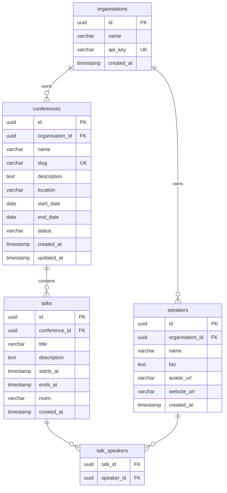

# Data model

## Design rationale

The core multi-tenancy unit is an **organisation** — a company or community that runs conferences. Every resource is
scoped to an organisation via a foreign key; the API key middleware ensures organisations only see their own data.

**Speakers** are organisation-level (not conference-level) so the same speaker profile can be reused across multiple
conferences without duplicating bio/avatar data.

**Talks** are the join between a conference and a speaker, plus the scheduling metadata (time, room). A talk can have a
null `speaker_id` to represent TBD or panel slots.

The `conferences.status` column (`draft` | `published` | `cancelled`) gates the public schedule endpoint — only
published conferences are visible without an API key.

## Entity-relationship diagram

## Notes

- `conferences.slug` is unique globally (not just per organisation) so it can be used in public URLs without leaking
  organisation structure.
- `api_key` is stored as a plain random string (e.g. `crypto.randomUUID()`). In production, store a hash and compare
  with a timing-safe function.
- `talk_speakers` is a join table — a talk can have zero or more speakers (zero supports TBD/panel sessions).
- No `tracks` table for now; a `room` string on talks is enough to power a schedule view. A tracks table would be a
  natural next addition.
